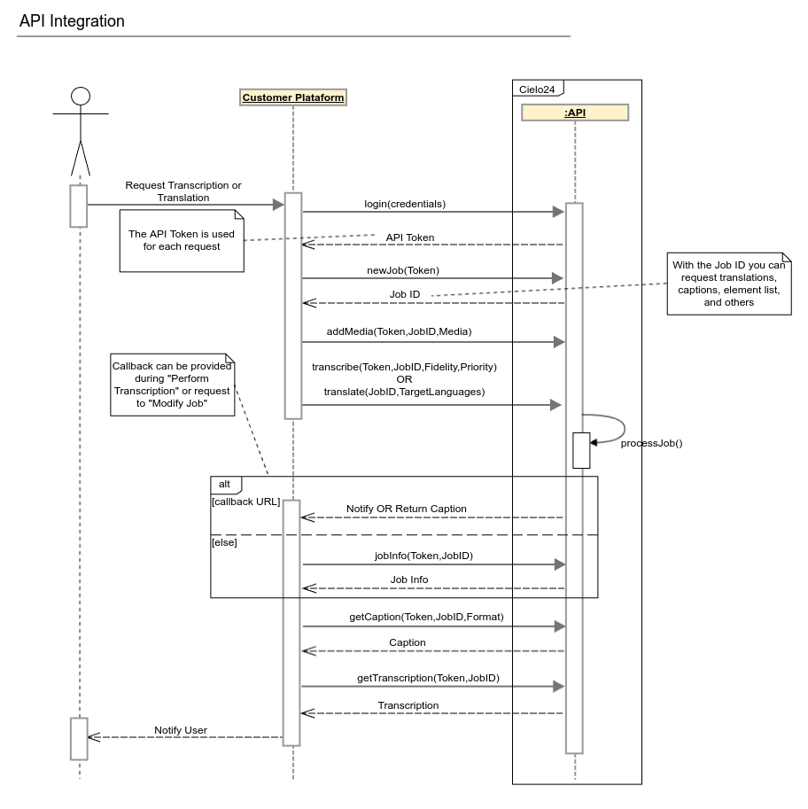

# Cielo24 API Documentation

Before start using the API, we suggest reading our [Getting Started](/basics.md) guide.

The full documentation for Cielo24 following the OpenAPI standards can be found [here](doc_md/README.md).


The following diagram shows a general high level overview on how to use Cielo24's API



## Generating client code

`openapi-generator` is required to generate the client code, to install it follow the instructions available at: https://openapi-generator.tech/docs/installation

This command shows how to generate the client code for any desired language:

```
openapi-generator generate --package-name=cielo24 -i cielo24.yml -g LANGUAGE
```

Where `LANGUAGE` can be any of the following:


>ada, ada-server, android, apache2, apex, asciidoc, aspnetcore, avro-schema, bash, crystal, c, clojure, cwiki, cpp-qt-client, cpp-qt-qhttpengine-server, cpp-pistache-server, cpp-restbed-server, cpp-restsdk, cpp-tiny, cpp-tizen, cpp-ue4, csharp, csharp-netcore, csharp-dotnet2, csharp-netcore-functions, dart, dart-dio, eiffel, elixir, elm, erlang-client, erlang-proper, erlang-server, fsharp-functions, fsharp-giraffe-server, go, go-echo-server, go-server, go-gin-server, graphql-schema, graphql-nodejs-express-server, groovy, kotlin, kotlin-server, kotlin-spring, kotlin-vertx, ktorm-schema, haskell-http-client, haskell, haskell-yesod, java, jaxrs-cxf-client, java-inflector, java-micronaut-client, java-micronaut-server, java-msf4j, java-pkmst, java-play-framework, java-undertow-server, java-vertx, java-vertx-web, java-camel, jaxrs-cxf, jaxrs-cxf-extended, jaxrs-cxf-cdi, jaxrs-jersey, jaxrs-resteasy, jaxrs-resteasy-eap, jaxrs-spec, javascript, javascript-apollo, javascript-flowtyped, javascript-closure-angular, jmeter, k6, lua, markdown, mysql-schema, nim, nodejs-express-server, objc, ocaml, openapi, openapi-yaml, plantuml, perl, php, php-laravel, php-lumen, php-slim-deprecated, php-slim4, php-symfony, php-mezzio-ph, php-dt, powershell, protobuf-schema, python-legacy, python, python-fastapi, python-experimental, python-flask, python-aiohttp, python-blueplanet, r, ruby, ruby-on-rails, ruby-sinatra, rust, rust-server, scalatra, scala-akka, scala-akka-http-server, scala-finch, scala-httpclient-deprecated, scala-gatling, scala-lagom-server, scala-play-server, scala-sttp, scalaz, spring, dynamic-html, html, html2, swift5, typescript, typescript-angular, typescript-aurelia, typescript-axios, typescript-fetch, typescript-inversify, typescript-jquery, typescript-nestjs, typescript-node, typescript-redux-query, typescript-rxjs, wsdl-schema

## Pre-generated clients:
- [Python 3](https://github.com/cielo24/cielo24-python)
- [C#](https://github.com/cielo24/cielo24-csharp)
- [Java](https://github.com/cielo24/cielo24-java)
- [Ruby](https://github.com/cielo24/cielo24-ruby)
- [Javascript](https://github.com/cielo24/cielo24-js)
- [Typescript](https://github.com/cielo24/cielo24-ts)
